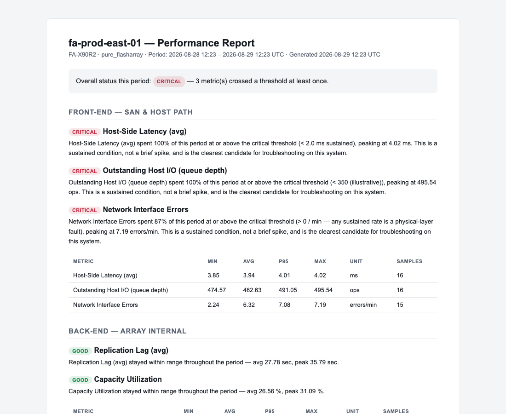
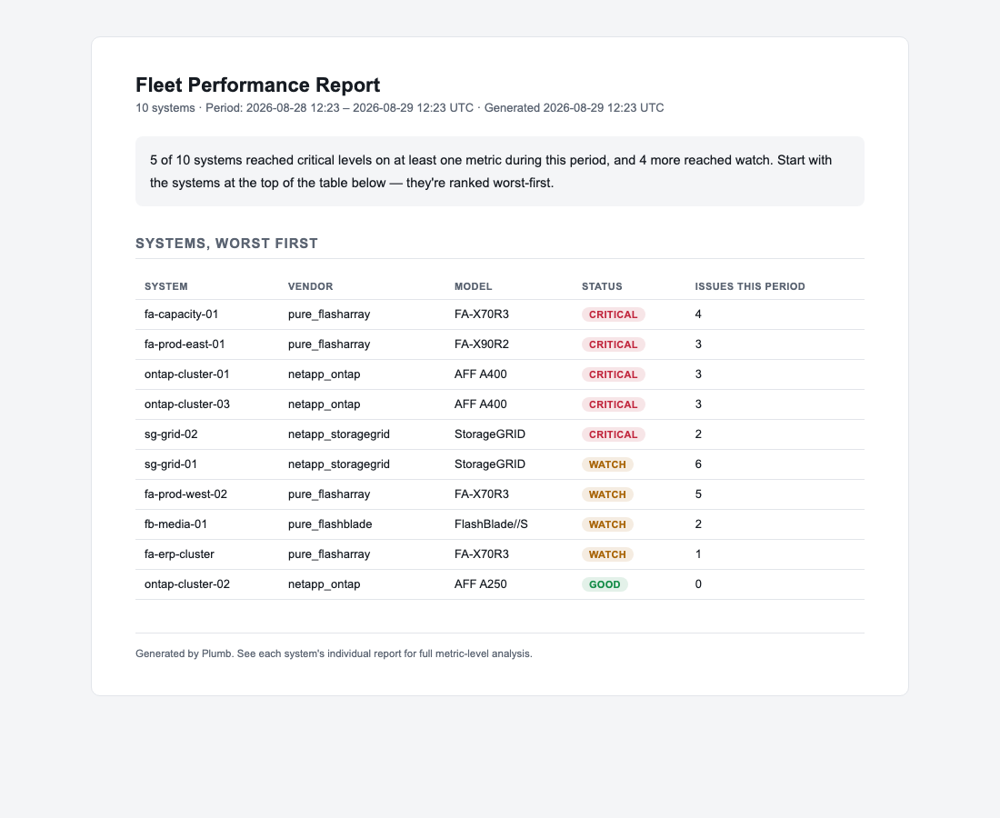

# Reports & Data Export

Plumb generates two kinds of report and one kind of raw export, all computed
on demand from VictoriaMetrics's stored history — none of it depends on a
separate "findings log" being kept over time. This document explains what
each contains, how the numbers are computed, and how to read the written
analysis.

## Table of Contents

1. [Array Report](#1-array-report)
2. [Fleet Report](#2-fleet-report)
3. [CSV Export](#3-csv-export)
4. [How the Numbers Are Computed](#4-how-the-numbers-are-computed)
5. [How the Written Analysis Is Generated](#5-how-the-written-analysis-is-generated)
6. [Reading a Report as Evidence, Not Just a Summary](#6-reading-a-report-as-evidence-not-just-a-summary)

---

## 1. Array Report

**Endpoint:** `GET /api/reports/array/{id}?hours=N` (default 7 days)
**UI:** the "Report" button next to the selected array's timerange controls

A self-contained HTML document (no external assets — safe to email or save)
covering one system over the requested period:

- **Overall status** — the worst severity any metric reached during the
  period, and a count of how many metrics crossed a threshold at least once.
- **Front-End and Back-End sections**, matching the live dashboard's split,
  each metric shown with:
  - **Min / Avg / P95 / Max** over the period
  - **Sample count** — how much data the period actually contained (useful
    for spotting a gap in collection, not just a gap in the metric itself)
  - A **written analysis paragraph** — see [Section 5](#5-how-the-written-analysis-is-generated)

This is the document to attach to a change ticket, send to an application
owner, or keep as a dated record of a system's state during an incident
window.



## 2. Fleet Report

**Endpoint:** `GET /api/reports/fleet?hours=N` (default 7 days)
**UI:** the "Fleet report" button above the fleet strip

The same period, rolled up across every configured system:

- **A ranked table** — every system, worst-status-first, then by issue
  count. The system most worth looking at is always row one.
- **A one-paragraph fleet-wide narrative** — how many systems reached watch
  or critical during the period, and a pointer to start at the top of the
  table.

This is the document for a weekly ops review or a "what needs attention
across everything we run" check — it deliberately doesn't repeat each
system's full metric detail (that's the array report's job); it exists to
tell you *which* array report to open first.



## 3. CSV Export

**Endpoint:** `GET /api/export/{id}?hours=N`
**UI:** the "Export CSV" button next to the array report button

Every metric defined for that system's vendor, as raw time-series data, in
long format:

```csv
array_id,metric_id,metric_label,category,unit,timestamp_unix,timestamp_iso,value
fa-prod-east-01,host_latency,Host-Side Latency (avg),frontend,ms,1787845560,2026-08-27T18:26:00Z,4.27
fa-prod-east-01,host_latency,Host-Side Latency (avg),frontend,ms,1787845620,2026-08-27T18:27:00Z,4.10
...
```

**Long format, not wide, on purpose** — one row per (metric, timestamp), not
one column per metric. This is what pivots cleanly in a spreadsheet
regardless of how many metrics a given vendor defines, and it's what you
want if you're correlating Plumb's data against an application's own logs
or another monitoring system's export for the same time window — join on
`timestamp_unix`.

Use this when a report's summary statistics aren't enough and you need the
actual samples — feeding another analysis tool, building a custom chart, or
providing raw evidence alongside a report.

---

## 4. How the Numbers Are Computed

All three report/export features query VictoriaMetrics directly for the
requested period — there's no separate pre-aggregated report database, which
is why a report or export for a time range from before Plumb was even
running against a given array will simply show `SampleCount: 0` for every
metric rather than an error.

For a report, the query step (the resolution VictoriaMetrics is asked to
return points at) is `period / 300` for reports and `period / 500` for CSV
export, floored at 15 seconds. A 7-day report therefore samples roughly
every 33 minutes; a 1-hour report samples roughly every 12 seconds. This
means percentile and trend calculations on a very short period (an hour or
less) are working with fewer data points and are correspondingly less
statistically robust — treat a 1-hour report's P95 as indicative, and a
7-day report's P95 as reliable.

**Percentile (P95) calculation:** the report sorts all sampled values for a
metric over the period and takes the value at the 95th-percentile index —
a standard nearest-rank method, not an interpolated percentile. With few
samples (a short period), this can jump between adjacent actual values
rather than smoothly.

**Trend calculation:** the average of the first quarter of the period's
samples is compared to the average of the last quarter. A report only
states a trend when the two differ by 15% or more in either direction —
smaller moves are treated as noise and go unmentioned, deliberately, so the
report doesn't cry wolf on every minor fluctuation.

## 5. How the Written Analysis Is Generated

Every metric's paragraph in an array report follows the same decision tree
(`internal/report/report.go`'s `narrate()` function) — it's deterministic
and reproducible, not a black box, and not an LLM-generated summary:

1. **No data** → says so plainly, doesn't fabricate a value.
2. **≥10% of samples at critical** → flagged as a sustained condition, "the
   clearest candidate for troubleshooting on this system."
3. **Any samples at critical, but <10%** → flagged as a brief spike, worth a
   quick check for what coincided with it, but not treated as ongoing.
4. **≥20% of samples at watch** → flagged as consistently elevated, with a
   specific suggestion to re-baseline the threshold or investigate sustained
   load.
5. **Some samples at watch, <20%** → flagged as occasional, with the period
   average given for context.
6. **Everything in range** → a plain summary statement (average and peak),
   no alarm language.
7. **On top of any of the above**, if the trend calculation
   ([Section 4](#4-how-the-numbers-are-computed)) found a ≥15% move, a
   sentence is appended noting the direction — even a metric that's
   currently "in range" gets flagged if it's trending toward a threshold,
   consistent with [PERFORMANCE-ANALYSIS.md §5](PERFORMANCE-ANALYSIS.md#5-reading-a-trend-not-just-a-value).

The fleet report's narrative is similarly rule-based: it counts how many
systems reached each severity level during the period and selects one of
three fixed sentence templates depending on whether any system reached
critical, only watch, or neither.

## 6. Reading a Report as Evidence, Not Just a Summary

A report's written analysis is a starting point for a conversation, not a
substitute for looking at the underlying data when the stakes are high. In
particular:

- The analysis text is generated from **fixed thresholds**
  ([PERFORMANCE-ANALYSIS.md §6](PERFORMANCE-ANALYSIS.md#6-why-plumbs-thresholds-are-illustrative-not-gospel))
  — if you haven't tuned `severity_watch`/`severity_critical` for a
  workload, the report's severity language inherits whatever bias the
  shipped defaults have for that workload.
- The report doesn't know about maintenance windows, planned rebuilds, or
  scheduled batch jobs — a "sustained critical" reading during a known
  maintenance window isn't a surprise finding, it's expected behavior the
  report has no way to distinguish from a real problem.
- For anything going into a formal incident record, change ticket, or
  vendor escalation, pair the report with the CSV export
  ([Section 3](#3-csv-export)) so the raw numbers are auditable independent
  of the generated prose.
